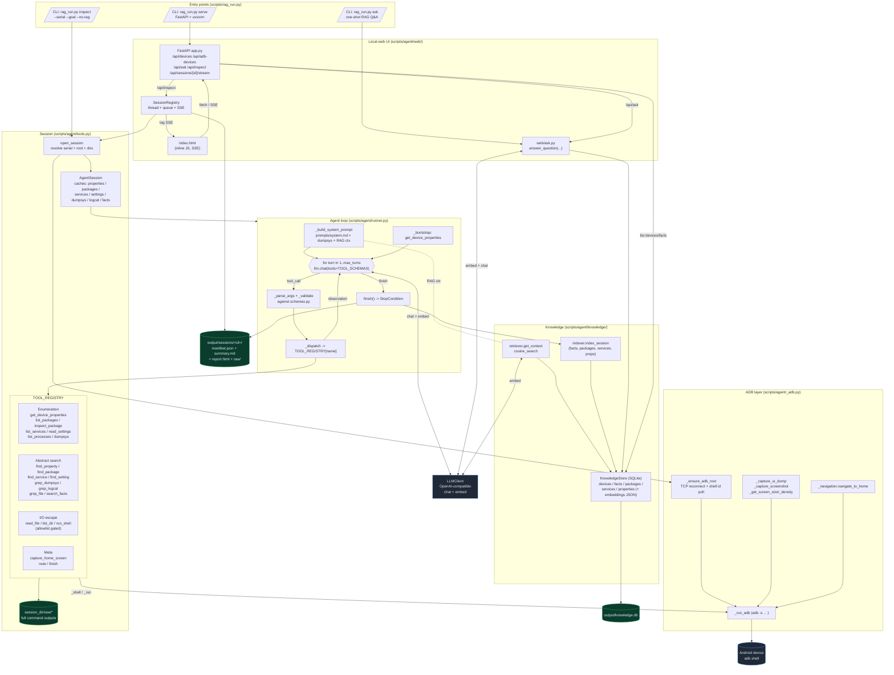

# Architecture Flowchart

Top-down view of the RAG-powered Android System Analyzer. This is the
canonical reference diagram for the repo — keep it in sync when the
agent loop, tool surface, web app, or knowledge store change shape.

## How to read it

1. **Entry points** — three CLI subcommands (`inspect`, `serve`, `ask`)
   plus the FastAPI web UI served by `serve`.
2. **Web** — `index.html` ↔ `app.py`. `/api/inspect` spawns a
   `SessionRegistry` background thread that streams logs to the browser
   via Server-Sent Events.
3. **`open_session`** resolves the device serial, runs
   `_ensure_adb_root` (TCP-aware: reconnects and polls `adb shell id`
   after `adb root` restarts adbd), and builds an `AgentSession`
   carrying the in-memory caches that the `find_*` / `grep_*` tools
   rely on.
4. **Agent loop** — `_build_system_prompt` composes
   [scripts/agent/prompts/system.md](scripts/agent/prompts/system.md)
   + the dumpsys cheatsheet + any RAG context retrieved from the
   knowledge store. Each turn the runner calls the LLM with
   `TOOL_SCHEMAS`, validates the tool call, and dispatches into
   `TOOL_REGISTRY`.
5. **Tools** split into four groups: broad enumeration, abstract
   search (regex over cached data), I/O escape hatches, and meta
   (`note`, `finish`, `capture_home_screen`). Every call's full output
   lands under `session_dir/raw/`.
6. **Knowledge** — when `finish` fires, the indexer writes facts /
   packages / services / properties to
   [output/knowledge.db](output/knowledge.db). The next inspection's
   runner pulls relevant rows back via the retriever and embeds them
   into the system prompt — this is the "RAG" loop.
7. **Ask flow** is the simpler subset: `web/ask.py` (or the `ask`
   CLI subcommand) embeds the question, cosine-searches `facts`, and
   asks the LLM to answer **grounded in those citations only**.

## When to update this diagram

Edit this file whenever any of the following change shape:

- A new top-level CLI subcommand or web route.
- A new tool family in `scripts/agent/tools.py` (and its schema).
- A new table or store backend under `scripts/agent/knowledge/`.
- A change to how `open_session` resolves serial / root / dirs.
- A new artifact written under `output/sessions/<id>/`.

The pointer in
[.github/instructions/core-workspace.instructions.md](.github/instructions/core-workspace.instructions.md)
makes this diagram part of the standing context for every workspace task.
